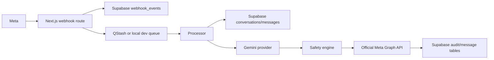

# Architecture

```mermaid
flowchart LR
 Meta --> Webhook[Next.js webhook route]
 Webhook --> Idem[Supabase webhook_events]
 Webhook --> Queue[QStash or local dev queue]
 Queue --> Proc[Processor]
 Proc --> Memory[Supabase conversations/messages]
 Proc --> Gemini[Gemini provider]
 Gemini --> Safety[Safety engine]
 Safety --> Sender[Official Meta Graph API]
 Sender --> Logs[Supabase audit/message tables]
```

Webhook routes validate and acknowledge. The processor is idempotent. QStash is the production queue option; inline processing is for local development only.
